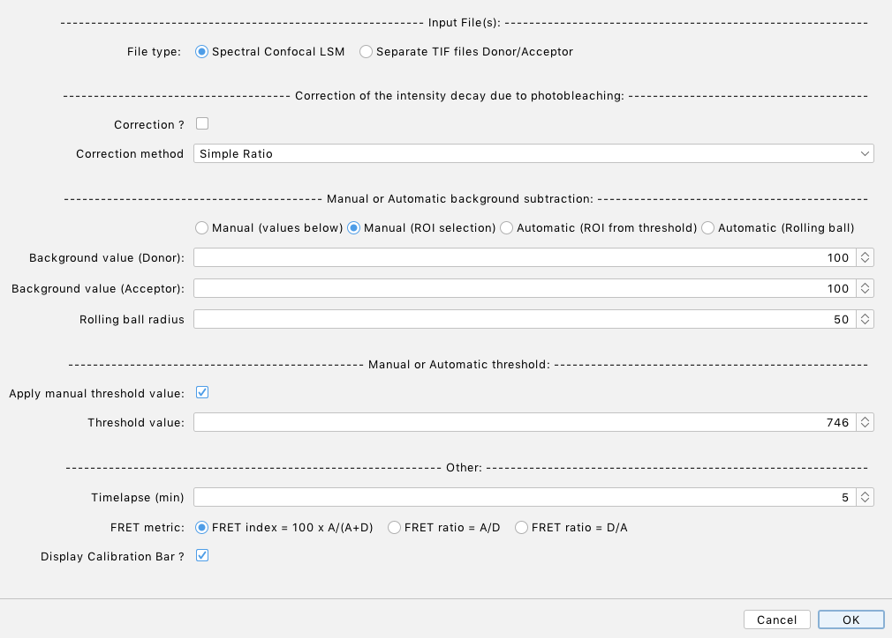

# FRET
an [ImageJ](http://imagej.net/Welcome)/[Fiji](https://fiji.sc) python script for [FRET](https://en.wikipedia.org/wiki/Förster_resonance_energy_transfer) (Förster Resonance Energy Transfer) calculation at the nuclear envelope or in the cytoplasm for FRET standard constructs.

## License
 
FRET runs under the  [BSD-3 License](https://opensource.org/licenses/BSD-3-Clause)

---
This document describes the workings of the ImageJ/Fiji python script **FRET.py**, written by Philippe Girard ([email](philippe.girard@ijm.fr)).

 

 
